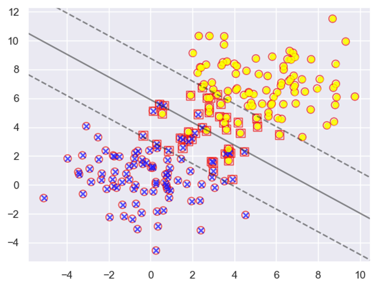
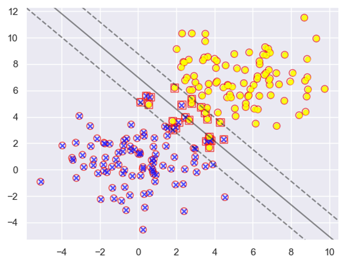

T2:  费祥(120090414)，沈嘉佑(119010259)

when C = 0.01:

when C = 0.1:

$\alpha_i=0$: means the corresponding data are correctly classified and doesn’t contribute to the classifier, locating outside of the margin. The data is not support vector.

$\alpha_i=C$: in this case, µi = 0; then we have ξi > 0. The corresponding data contributes to the classifier, locating inside the margin, here we should pay attention that these points are not exactly on the margin. In fact, the points locate on the margin satisfies $0<\alpha_i<C$.

ξi > 0 data points are those inside the margin, the corresponding $\alpha_i=C$. They are a part of support vectors.