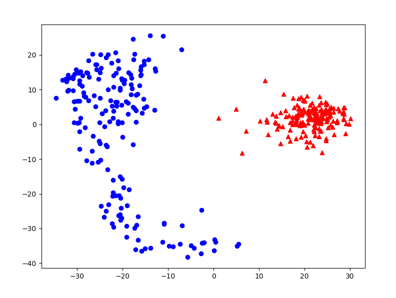

# PCA assignment report

**Name: Xiang Fei**

**Student ID:120090414**

### code
```python
import matplotlib.pyplot as plt
import numpy as np
from sklearn import datasets

def get_data():
    digits = datasets.load_digits()
    X = digits.images
    Y = digits.target
    X_0 = X[(Y == 0)]
    Y_0 = [0 for i in range(X_0.shape[0])]
    X_1 = X[(Y == 1)]
    Y_1 = [1 for i in range(X_1.shape[0])]

    X_new = np.concatenate((X_0, X_1), axis=0).reshape((360, 64))
    Y_new = np.concatenate((Y_0, Y_1), axis=0)
    return X_new, Y_new

def zero_mean(X):      
    mean_value=np.mean(X,axis=0)
    new_X=X-mean_value
    return new_X, mean_value

def calculate_PCs():
    X,Y = get_data()
    new_X, mean_value = zero_mean(X)
    cov_matrix=np.cov(new_X,rowvar=0)
    eig_values,eig_vectors=np.linalg.eig(np.mat(cov_matrix))
    eig_index=np.argsort(eig_values)
    eig_2_index=eig_index[-1:-3:-1]
    eig_2_vectors=eig_vectors[:,eig_2_index]
    low_X=new_X*eig_2_vectors
    low_X_arr = low_X.A
    PC1 = low_X_arr[:,0]
    PC2 = low_X_arr[:,1]
    return PC1, PC2, Y

def draw_graph():
    PC1, PC2, Y = calculate_PCs()
    X_0_PC1 = PC1[(Y == 0)]
    X_0_PC2 = PC2[(Y == 0)]
    plt.scatter(X_0_PC1, X_0_PC2, marker='^', c="r")

    X_1_PC1 = PC1[(Y == 1)]
    X_1_PC2 = PC2[(Y == 1)]
    plt.scatter(X_1_PC1, X_1_PC2, marker='o', c="b")

    plt.show()

draw_graph()
```

### graph

